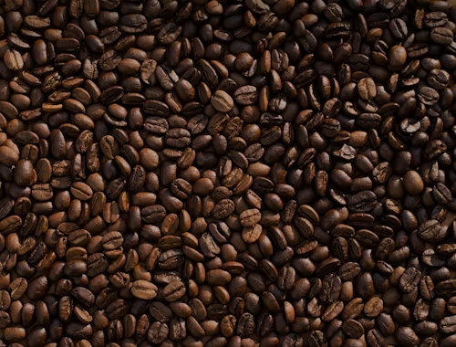

# Kirkbride_Mawwell_Midterm

<h1>Coffee VS Tea</h1>
 

Coffee is a superior choice when it comes to a hot or cold beverage to sip on; especially in the mornings.
Coffee has a higher caffeine content than any tea which causes a higher level of alertness, which is very beneficial for a good start to any day.
This improved alertness can help increase your safety with driving, operating machinery, or other jobs or tasks that require high alertness for your and every one else's safety.

 

Coffee has many other benefits other than just saving your life on a daily basis; some of these include increasing your fiber intake, 
and helping you feel better by improving your gut health with it's polyphonols which feed beneficial bacterias.
Not only that, but it can help save your life in the long term by lowering your risk of several cancers as much as 13%; as well as preventing type 2 diabetes by as much as 25%;
it's chlorogenic acid has been shown in studies to improve insulin sensitivity.

 

<h2>Credits</h2>
 

https://www.washingtonpost.com/wellness/interactive/2022/coffee-vs-tea-nutrition-health/
https://www.forbes.com/health/nutrition/coffee-vs-tea/

 

Why Choose Tea? Great Question!

This is a popular beverage that you can drink with breakfast, lunch or dinner. It is also beneficial for persons who are sensitive to caffeine or wish to reduce their intake.
 

Let’s Spill The Tea on What It Does For Your Health! 

Tea is essentially gentler on your stomach since it has less acidic than coffee making it a better option for those with a sensitive stomach or acid reflux issues. It can also improve hydration, especially herbal teas, due its water content making it a better option for maintaining fluid balance throughout the day. 
 
Lastly, Relaxation Time!

 

